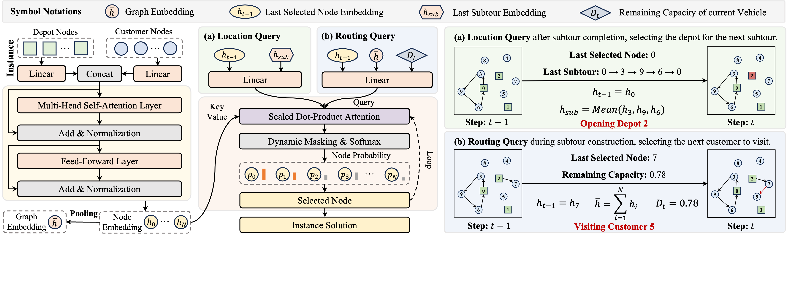

# An End-to-end Learning Approach for Solving Capacitated Location-Routing Problems

This repository contains the official implementation of the paper **“An End-to-end Learning Approach for Solving Capacitated Location-Routing Problems”**.

Our method provides an end-to-end learning framework for solving the **Capacitated Location-Routing Problem (CLRP)**. This repository includes code for **data generation**, **model training**, and **model evaluation**. We also provide **datasets** and **pretrained checkpoints** for all problem scales considered in the paper.

---

## Framework Overview

The overall pipeline of the proposed method is illustrated below.

<p align="center">
  
</p>

---

## Dependencies

The code has been tested with the following main dependencies:

- `matplotlib==3.5.3`
- `numpy==1.23.4`
- `pandas==1.5.2`
- `pytz==2022.1`
- `torch==1.10.2`

---

## Data Generation

The dataset can be generated by running:

```bash
python ./data/gen_data.py
```

The parameter configuration in `gen_data.py` can be modified according to your needs, such as the number of depots, the number of customers, and the number of generated instances.

The generated dataset is saved in `.pkl` format with the following naming convention:

```text
{a}_{b}_{c}.pkl
```

where:

- `a` denotes the number of depots,
- `b` denotes the number of customers,
- `c` denotes the number of instances.

For example,

```text
5_100_1000.pkl
```

means that the dataset contains:

- `5` depots,
- `100` customers,
- `1000` instances.

---

## Training

After preparing the environment and generating the dataset, training can be launched by:

```bash
python LRP__Train.py
```

Before training, please make sure that the corresponding configuration matches the target dataset and problem scale.

---

## Evaluation

To evaluate a trained model, run:

```bash
python LRP__Eval.py
```

Before evaluation, please pay special attention to the following parameters:

- `load_path`: path to the evaluation dataset
- `model_load`: path to the pretrained model checkpoint
- `sample_size`: sampling size should be equal to customer size

**Important:** the `sample_size` used in evaluation should be kept consistent with the corresponding experimental setting. Otherwise, the evaluation results may be inconsistent.

Please make sure that `load_path`, `model_load`, and `sample_size` are set correctly before running evaluation.

## Acknowledgement

Our implementation is built upon or inspired by several excellent open-source projects. In particular, we would like to thank the authors of the following repositories for sharing their code and ideas:

- [POMO](https://github.com/yd-kwon/POMO)
- [MD_MTA](https://github.com/Good9T/MD_MTA)

Their open-source contributions have been highly valuable to this work.
